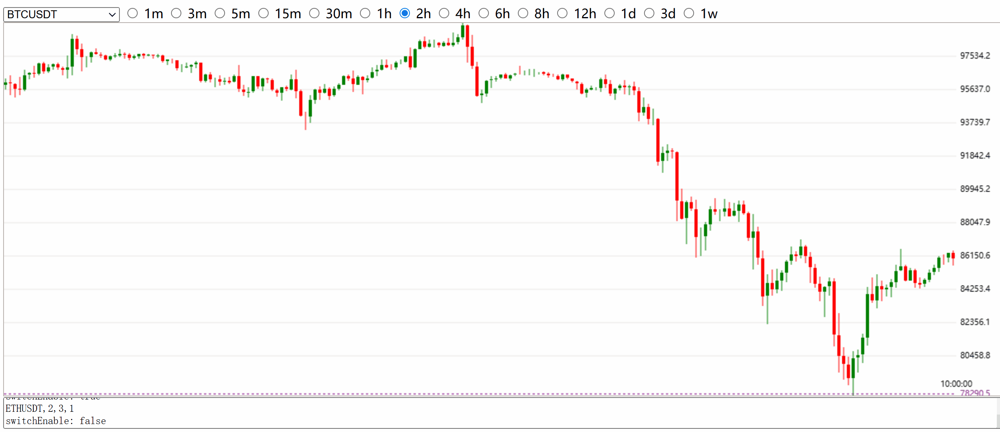

# Introduction
This repository provides an Erlang-based API for copy trading on Binance. It supports automatic switching between the K-lines (Candlesticks) of multiple digital currencies. When the mouse moves, a horizontal line will be displayed to represent the stop loss price. In addition, the take profit price will also be set when placing an order.

# Switching
When opening `mychart.html` in a browser, the price candlestick of the current currency will be displayed on the screen, and by default, it will switch to the next digital currency every 2 seconds:  

# Periods
You can freely switch between different periods to display K-lines of different time spans:  

